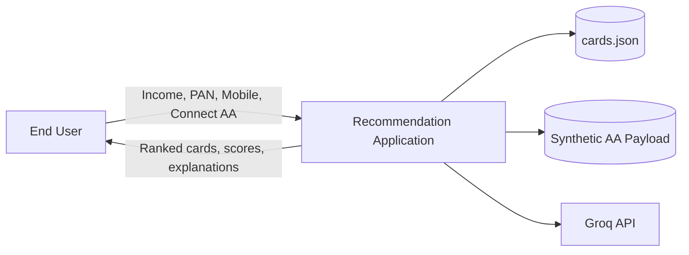
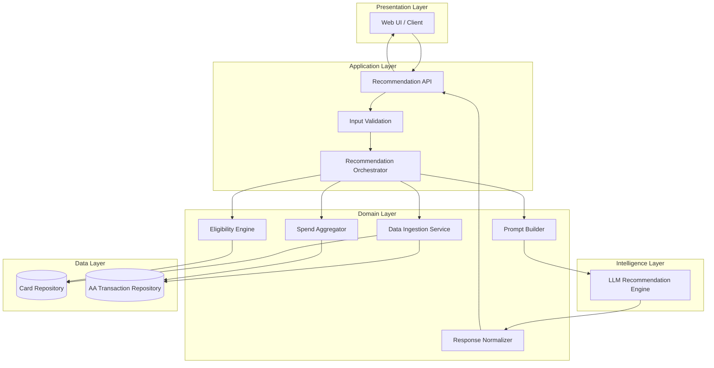
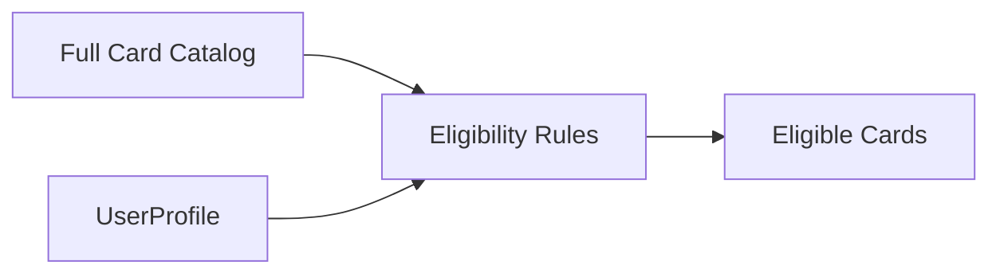
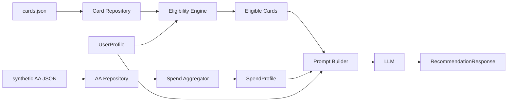
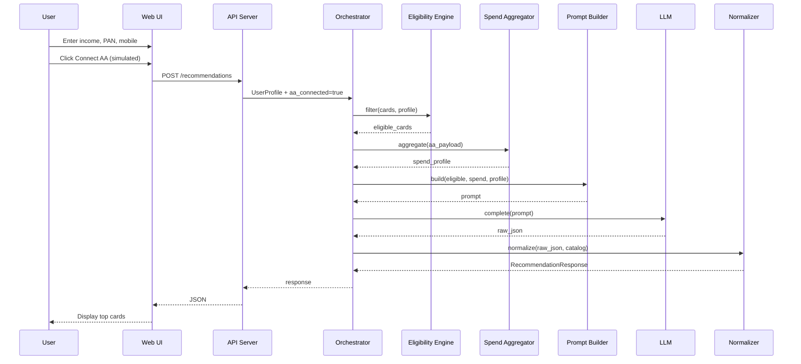
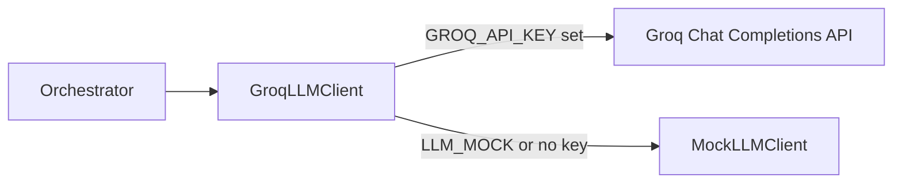
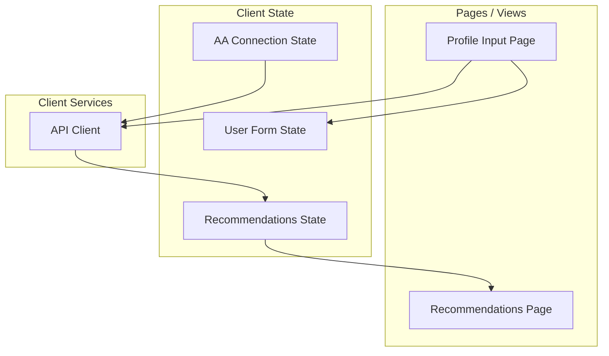
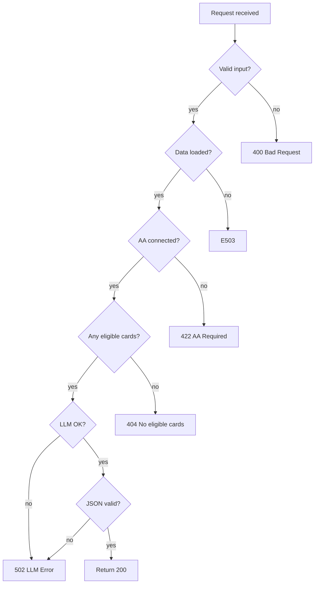
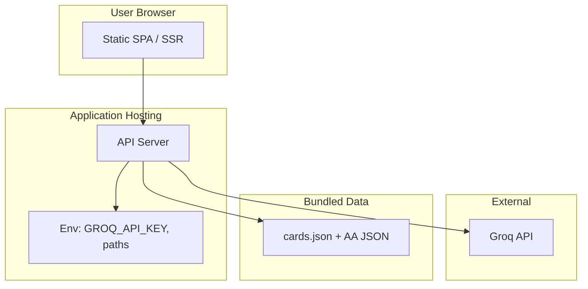

# Architecture: AI-Powered Credit Card Recommendation Engine

This document defines the technical architecture for the FreechargeBiz-style Axis Bank credit card recommendation service. It extends [`context.md`](./context.md) with component boundaries, data contracts, flows, and implementation guidance.

---

## Table of Contents

1. [Architecture Goals & Principles](#architecture-goals--principles)
2. [System Context](#system-context)
3. [Logical Architecture](#logical-architecture)
4. [Component Design](#component-design)
5. [Data Architecture](#data-architecture)
6. [Request & Sequence Flows](#request--sequence-flows)
7. [LLM Integration Design](#llm-integration-design)
8. [API Contract (Suggested)](#api-contract-suggested)
9. [Frontend Architecture](#frontend-architecture)
10. [Cross-Cutting Concerns](#cross-cutting-concerns)
11. [Suggested Repository Layout](#suggested-repository-layout)
12. [Technology Stack (Recommended)](#technology-stack-recommended)
13. [Deployment View](#deployment-view)
14. [Testing Strategy](#testing-strategy)
15. [Future Extensions](#future-extensions)

---

## Architecture Goals & Principles

| Goal | How the architecture supports it |
|------|----------------------------------|
| **Grounded recommendations** | Eligibility and rewards use structured `cards.json`; LLM reasons only over filtered, merged context—not hallucinated products |
| **Explainability** | LLM outputs ranked list + per-card rationale + net benefit; UI surfaces confidence and explanation |
| **Simulated AA without live integration** | Synthetic AA payload loaded or triggered in-process; same pipeline as production would use |
| **Maintainability** | Clear separation: ingestion → eligibility → prompt assembly → LLM → response normalization → UI |
| **Demo-ready FreechargeBiz UX** | Thin client, single recommendation API, fast feedback on AA “connect” |

**Design principles**

- **Structured data first:** Card catalog and AA aggregates are canonical; LLM interprets and narrates.
- **Fail closed on bad input:** Invalid PAN/mobile/income rejected before LLM call (cost and safety).
- **Deterministic preprocessing:** Filtering and spend aggregation are rule-based; LLM handles ranking, explanation, and simulation narrative.
- **Schema-valid LLM output:** Parse LLM JSON into typed models; fallback or retry on malformed responses.

---

## System Context

External actors and systems for the **in-scope** build:



| Actor / System | Role |
|----------------|------|
| **End user** | Submits profile, triggers simulated AA, views recommendations |
| **Card catalog** | Static/processed Axis Bank products at `data/processed/cards.json` |
| **Synthetic AA** | Developer-supplied transaction JSON mimicking Account Aggregator spend |
| **Groq (LLM)** | Hosted inference for rank, explain, and reward simulation (OpenAI-compatible chat API) |

**Explicitly out of scope:** Live AA consent flows, Axis Bank core banking APIs, CIBIL bureau APIs, non-Axis catalogs.

---

## Logical Architecture

Five layers map directly to the workflow in `context.md`:



### Layer responsibilities

| Layer | Responsibility |
|-------|------------------|
| **Presentation** | Forms, AA connect simulation, results cards with image, score, benefit, explanation |
| **Application** | HTTP/API, validation, session-less orchestration of one recommendation run |
| **Domain** | Business rules: load data, filter eligibility, aggregate spend, build prompts, validate LLM output |
| **Intelligence** | LLM calls with structured prompts and JSON-mode responses where supported |
| **Data** | File-based or DB-backed access to cards and synthetic AA payloads |

---

## Component Design

### 1. Data Ingestion Service

**Purpose:** Load and normalize card catalog and AA data at startup or on demand.

| Input | Output |
|-------|--------|
| `data/processed/cards.json` | `List<CardProduct>` |
| Synthetic AA file(s) e.g. `data/synthetic/aa_transactions.json` | `List<Transaction>` or pre-aggregated `SpendProfile` |

**Behaviors**

- Parse JSON; validate required fields (name, annual fee, reward categories, APR, eligibility thresholds).
- Map raw reward rules into an internal model (category → earn rate, caps, exclusions).
- Optionally cache in memory after first load (catalog is small).

**Failure modes:** Missing file → 503 with clear message; malformed row → log and skip or fail fast per team policy.

---

### 2. User Input & Validation Module

**Purpose:** Accept and validate user profile before orchestration.

| Field | Validation (suggested) |
|-------|-------------------------|
| Annual income | Positive number, min/max sanity bounds |
| PAN | Format `AAAAA9999A` (simulated; no live NSDL check) |
| Mobile | 10-digit Indian mobile pattern |
| AA connection | Boolean or enum `connected` after simulated trigger |

Validated payload becomes `UserProfile` passed to eligibility and prompt builder.

---

### 3. Eligibility Engine

**Purpose:** Reduce candidate cards using **structured rules only** (no LLM).

**Typical rules (from card metadata)**

- `min_income` ≤ user annual income
- `min_cibil` ≤ user CIBIL (from profile or synthetic default when not collected)
- Product flags: salaried/self-employed, city tier, etc., if present in `cards.json`

**Output:** `List<EligibleCard>` — subset of catalog with eligibility metadata attached.



---

### 4. Spend Aggregator (AA Processor)

**Purpose:** Turn synthetic AA transactions into a **spend profile** the LLM and optional deterministic calculator can use.

**Aggregations (recommended)**

| Dimension | Example |
|-----------|---------|
| By category | Food, Travel, Fuel, Shopping, Utilities, Others |
| Totals | Monthly / annual spend per category |
| Patterns | Top merchants, online vs offline ratio (optional) |

**Output:** `SpendProfile` — e.g. `{ "annual_by_category": { "dining": 120000, "travel": 80000 }, "total_annual": 500000 }`.

Triggered when user clicks **Connect Account Aggregator (Simulated)** — loads fixed or user-id-keyed synthetic file rather than calling external AA.

---

### 5. Integration Layer (Orchestrator + Prompt Builder)

**Purpose:** Merge `EligibleCard[]` + `SpendProfile` + `UserProfile` into a single **LLM context package**.

**Prompt Builder inputs**

- User: income, CIBIL (if any), AA connected flag
- Spend: category breakdown and totals
- Cards: for each eligible card — name, fee, APR, reward rules summary, image URL

**Prompt Builder outputs**

- System instructions (role, constraints, JSON schema)
- User message with structured JSON blob
- Optional few-shot example for stable JSON shape

The **Recommendation Orchestrator** coordinates: ingest → eligibility → spend (if AA connected) → prompt → LLM → normalize → API response.

---

### 6. LLM Recommendation Engine

**Purpose:** Rank cards, explain fit, simulate net annual benefit.

**Responsibilities**

| Task | LLM role |
|------|----------|
| Rank by fit | Order eligible cards; assign confidence 0–1 or 0–100 |
| Explain | Per-card narrative tied to spend categories |
| Simulate rewards | Estimate annual rewards minus annual fee → **net annual benefit** |

**Guardrails**

- Instruct model to only recommend cards present in the provided list.
- Require JSON output matching `RecommendationResponse` schema.
- Temperature low–medium (e.g. 0.2–0.5) for consistent rankings.

Optional **hybrid approach:** deterministic reward calculator for numeric net benefit; LLM for ranking and explanation only—reduces hallucinated math. For MVP, full LLM simulation is acceptable per `context.md`.

---

### 7. Response Normalizer

**Purpose:** Parse LLM output, validate schema, enrich with static assets.

- Attach `image_url` from catalog if LLM omitted it
- Clamp confidence to [0, 1]
- Sort by rank
- Limit to top N (e.g. 3–5)
- On parse failure: retry once with “fix JSON” prompt; else return error

---

### 8. Output Display (Presentation)

**Purpose:** FreechargeBiz-style results screen.

**Per recommendation card**

| UI element | Source field |
|------------|--------------|
| Card name & image | `card_name`, `image_url` |
| Confidence score | `confidence_score` (progress bar or badge) |
| Net annual benefit | `net_annual_benefit_inr` |
| Explanation | `explanation` (markdown or plain text) |

**UX flow:** Landing → Profile form → “Connect AA” (simulated) → Loading → Results list.

---

## Data Architecture

### Card product schema (conceptual)

Stored in `data/processed/cards.json` as an array of objects:

```json
{
  "id": "axis-ace",
  "name": "Axis Bank ACE Credit Card",
  "image_url": "/assets/cards/axis-ace.png",
  "annual_fee_inr": 499,
  "apr_percent": 42.0,
  "min_income_inr": 600000,
  "min_cibil": 750,
  "reward_categories": [
    { "category": "utilities", "rate_percent": 5, "monthly_cap_inr": 500 }
  ],
  "default_earn_rate_percent": 1.5,
  "highlights": ["5% on bill pay utilities"]
}
```

### Synthetic AA schema (conceptual)

```json
{
  "user_ref": "demo-user-1",
  "transactions": [
    {
      "date": "2025-03-15",
      "amount_inr": 2500,
      "category": "dining",
      "merchant": "Swiggy",
      "type": "debit"
    }
  ]
}
```

### Internal domain models

| Model | Key fields |
|-------|------------|
| `UserProfile` | income, pan, mobile, cibil?, aa_connected |
| `CardProduct` | id, name, fees, APR, rewards, eligibility |
| `SpendProfile` | annual_by_category, total_annual |
| `EligibleCard` | CardProduct + passed_rules[] |
| `CardRecommendation` | rank, card_id, name, confidence, net_annual_benefit, explanation, image_url |
| `RecommendationResponse` | recommendations[], generated_at, disclaimer |

### Data flow diagram



---

## Request & Sequence Flows

### Primary flow: Get recommendations



### Alternate flow: Recommendations without AA

If user skips AA connect, orchestrator either:

- **Option A:** Return message “Connect AA for personalized results”, or  
- **Option B:** Use default/average spend profile (document choice in README)

Recommended for demo: **require simulated AA** so spend-based reasoning is always demonstrated.

---

## LLM Integration Design

**Provider:** [Groq](https://console.groq.com/) — used from Phase 4 onward for all live recommendation calls. Groq exposes an **OpenAI-compatible** Chat Completions API, so the backend can use the official `groq` Python SDK (recommended) or the OpenAI client with `base_url=https://api.groq.com/openai/v1`.

**Not in scope:** OpenAI, Anthropic, or other providers for the MVP/demo path (mock client remains for CI and local runs without a key).

### Groq client design

| Concern | Approach |
|---------|----------|
| **SDK** | `groq` Python package (`Groq.chat.completions.create`) |
| **Default model** | `llama-3.3-70b-versatile` (strong reasoning + JSON adherence; swap via `GROQ_MODEL`) |
| **Alternates** | `llama-3.1-8b-instant` (faster/cheaper), `mixtral-8x7b-32768` |
| **Structured output** | `response_format={"type": "json_object"}` on chat completion |
| **Auth** | `GROQ_API_KEY` environment variable only (never sent to browser) |
| **Base URL** | `https://api.groq.com/openai/v1` (override with `GROQ_BASE_URL` if needed) |
| **Timeouts** | 30–60s; Groq is typically low-latency vs. general-purpose cloud LLMs |
| **CI / offline** | `LLM_MOCK=true` or missing key → `MockLLMClient` (no Groq call) |



### Prompt structure

1. **System message**  
   - You are a credit card advisor for Axis Bank products only.  
   - Use only cards in `eligible_cards`.  
   - Return valid JSON matching the schema.  
   - Tie explanations to `spend_profile` category amounts.

2. **User message (structured)**  
   ```json
   {
     "user_profile": { "annual_income_inr": 1200000, "cibil": 780 },
     "spend_profile": { "annual_by_category": { "dining": 96000 } },
     "eligible_cards": [ /* trimmed card objects */ ]
   }
   ```

3. **Expected response schema**  
   ```json
   {
     "recommendations": [
       {
         "rank": 1,
         "card_id": "axis-ace",
         "card_name": "Axis Bank ACE",
         "confidence_score": 0.92,
         "net_annual_benefit_inr": 15000,
         "explanation": "Your high utility spend aligns with 5% cashback..."
       }
     ]
   }
   ```

### Operational parameters

| Parameter | Suggestion |
|-----------|------------|
| Provider | **Groq** (`api.groq.com`) |
| Model | `llama-3.3-70b-versatile` (default); or `llama-3.1-8b-instant` for speed |
| Response format | `json_object` via Groq chat completions |
| Max tokens | Sized for 3–5 cards × explanation (e.g. 2048) |
| Retries | 1 on JSON parse failure |
| Timeout | 30–60s |
| Secrets | `GROQ_API_KEY` via environment variable only |

### Cost & latency control

- Send **eligible cards only** (post-filter), not full catalog.
- Truncate long reward T&C to summarized fields in prompt.
- Cache catalog load; do not re-read file per request unless hot-reload desired.

---

## API Contract (Suggested)

### `POST /api/v1/recommendations`

**Request body**

```json
{
  "annual_income_inr": 1200000,
  "pan": "ABCDE1234F",
  "mobile": "9876543210",
  "aa_connected": true,
  "cibil": 780
}
```

**Response 200**

```json
{
  "recommendations": [
    {
      "rank": 1,
      "card_id": "axis-ace",
      "card_name": "Axis Bank ACE Credit Card",
      "image_url": "/assets/cards/axis-ace.png",
      "confidence_score": 0.92,
      "net_annual_benefit_inr": 15000,
      "explanation": "..."
    }
  ],
  "meta": {
    "eligible_count": 8,
    "aa_connected": true,
    "disclaimer": "Simulated recommendations for demonstration only."
  }
}
```

**Error responses**

| Status | When |
|--------|------|
| 400 | Validation failed (PAN, mobile, income) |
| 422 | AA required but not connected |
| 502 | Groq / LLM provider error |
| 503 | Card or AA data unavailable |

### `GET /api/v1/health`

Liveness for deployment checks.

### `POST /api/v1/aa/connect` (optional)

Simulated AA: returns `{ "connected": true, "spend_profile_id": "demo-user-1" }` without external calls.

---

## Frontend Architecture



| Concern | Approach |
|---------|----------|
| Framework | React, Next.js, or Vue—team preference |
| State | Form library + single fetch for recommendations |
| Loading | Skeleton cards during LLM wait |
| Errors | Inline validation + toast for API/LLM failures |
| Assets | Card images from `public/` or CDN paths in catalog |

---

## Cross-Cutting Concerns

### Security & privacy (demo scope)

| Topic | Approach |
|-------|----------|
| PAN / mobile | Validate format; do not log full PAN in production logs; mask in UI |
| API keys | Server-side only; never expose `GROQ_API_KEY` to browser |
| PII storage | No persistent DB required for MVP; process in memory per request |
| Disclaimer | Show “not financial advice / simulated data” on results |

### Observability

- Structured logs: `request_id`, eligible_count, llm_latency_ms, token_usage
- Metrics: recommendation success rate, LLM error rate
- Optional: store anonymized prompt hashes for debugging (not raw PAN)

### Error handling strategy



### Configuration

| Variable | Purpose |
|----------|---------|
| `GROQ_API_KEY` | Groq API authentication (required for live recommendations) |
| `GROQ_MODEL` | Groq model id (default `llama-3.3-70b-versatile`) |
| `GROQ_BASE_URL` | Optional; default `https://api.groq.com` (do **not** include `/openai/v1`) |
| `LLM_MOCK` | If `true`, skip Groq and use `MockLLMClient` (CI/local) |
| `LLM_TIMEOUT_SECONDS` | Request timeout (default 60) |
| `LLM_TEMPERATURE` | Sampling temperature (default 0.3) |
| `LLM_MAX_TOKENS` | Max completion tokens (default 2048) |
| `CARDS_DATA_PATH` | Default `data/processed/cards.json` |
| `AA_DATA_PATH` | Synthetic transactions path |
| `TOP_N_RECOMMENDATIONS` | Default 3 |

**Legacy aliases (optional in code):** `LLM_API_KEY` / `LLM_MODEL` may map to Groq settings during migration; prefer `GROQ_*` in new deployments.

---

## Suggested Repository Layout

```
AI-Powered-Credit-Card-Recommendation/
├── docs/
│   ├── context.md
│   ├── architecture.md
│   └── problemStatement.txt
├── data/
│   ├── processed/
│   │   └── cards.json
│   └── synthetic/
│       └── aa_transactions.json
├── backend/
│   ├── app/
│   │   ├── main.py                 # or server entry
│   │   ├── api/
│   │   │   └── routes/
│   │   │       └── recommendations.py
│   │   ├── domain/
│   │   │   ├── ingestion.py
│   │   │   ├── eligibility.py
│   │   │   ├── spend_aggregator.py
│   │   │   ├── prompt_builder.py
│   │   │   └── normalizer.py
│   │   ├── services/
│   │   │   ├── orchestrator.py
│   │   │   └── llm_client.py   # GroqLLMClient + MockLLMClient
│   │   └── models/
│   │       ├── card.py
│   │       ├── user.py
│   │       └── recommendation.py
│   ├── tests/
│   └── requirements.txt
├── frontend/
│   ├── src/
│   │   ├── pages/
│   │   ├── components/
│   │   └── api/
│   └── package.json
└── README.md
```

---

## Technology Stack (Recommended)

| Layer | Option A | Option B |
|-------|----------|----------|
| Backend | **Python + FastAPI** | Node.js + Express |
| LLM SDK | **`groq`** (Groq Python SDK) | OpenAI SDK + `GROQ_BASE_URL` (compatible API) |
| Frontend | **React + Vite** | Next.js |
| Data | JSON files + in-memory cache | SQLite for cards (optional) |
| Validation | Pydantic / Zod | |
| Tests | pytest / vitest | |

Python + FastAPI is a strong default for rapid JSON APIs, Pydantic models aligned with LLM JSON output, and data science familiarity.

---

## Deployment View



| Environment | Notes |
|-------------|-------|
| **Local** | Backend on `:8000`, frontend on `:5173`, proxy `/api` to backend |
| **Staging** | Single container or PaaS (Railway, Render, Fly.io) with env secrets |
| **Production (future)** | Add WAF, rate limiting, real AA adapter behind consent service |

---

## Testing Strategy

| Level | Focus |
|-------|--------|
| **Unit** | Eligibility rules, spend aggregation by category, PAN/mobile validators |
| **Integration** | Load real `cards.json` + AA file; mock LLM with fixed JSON fixture |
| **Contract** | LLM response matches `RecommendationResponse` schema |
| **E2E** | Playwright/Cypress: fill form → connect AA → see ≥1 recommendation card |
| **Manual** | Spot-check net benefit plausibility vs hand calculation for one card |

**Mock LLM in CI** to avoid cost and flakiness; reserve live LLM calls for manual/demo runs.

---

## Future Extensions

When moving beyond the problem statement scope:

| Extension | Architectural impact |
|-----------|------------------------|
| Live Account Aggregator | New `AAAdapter` port; OAuth/consent service; replace synthetic repository |
| Real CIBIL | External bureau adapter; cache score with TTL |
| Deterministic rewards engine | Split “numbers” from LLM “narrative”; LLM only explains precomputed benefits |
| Multi-bank catalog | Plugin card providers; eligibility per issuer |
| A/B testing | Experiment service on prompt variants and ranking |

---

## Traceability to Project Context

| `context.md` workflow step | Architecture component(s) |
|----------------------------|---------------------------|
| 1. Data Ingestion | Data Ingestion Service, Card Repository, AA Repository |
| 2. User Input | Validation Module, Web UI forms |
| 3. Integration Layer | Eligibility Engine, Spend Aggregator, Prompt Builder, Orchestrator |
| 4. Recommendation Engine | LLM Recommendation Engine, Response Normalizer |
| 5. Output Display | Web UI results components |

---

## Document References

- [`docs/context.md`](./context.md) — Project scope, objectives, and workflow
- [`docs/problemStatement.txt`](./problemStatement.txt) — Original problem statement
