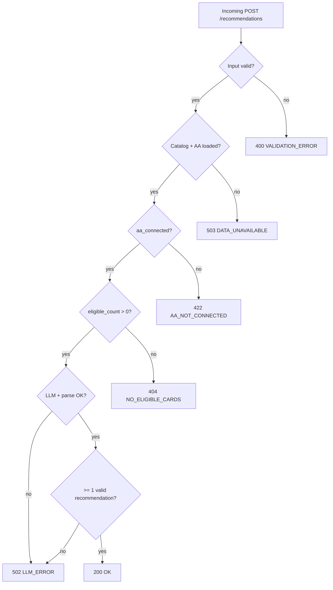

# Edge Cases & Exception Handling Guide

Comprehensive catalog of edge cases for the **AI-Powered Credit Card Recommendation Engine**. Use this during implementation, QA, and code review alongside [`context.md`](./context.md), [`architecture.md`](./architecture.md), and [`implementation-plan.md`](./implementation-plan.md).

**Legend**

| Priority | Meaning |
|----------|---------|
| **P0** | Must handle before demo/submission; incorrect behavior breaks trust or flow |
| **P1** | Should handle in MVP; degrade gracefully |
| **P2** | Nice-to-have; document or defer |

| Handling | Meaning |
|----------|---------|
| **Reject** | Fail request with explicit error |
| **Degrade** | Continue with reduced functionality or safe defaults |
| **Retry** | Automatic retry (bounded) |
| **Ignore** | Skip invalid item; continue processing |

---

## Table of Contents

1. [User Input & Validation](#1-user-input--validation)
2. [Account Aggregator (Simulated)](#2-account-aggregator-simulated)
3. [Data Ingestion & Catalog](#3-data-ingestion--catalog)
4. [Eligibility Engine](#4-eligibility-engine)
5. [Spend Aggregation](#5-spend-aggregation)
6. [Integration & Orchestration](#6-integration--orchestration)
7. [LLM Provider & Prompting](#7-llm-provider--prompting)
8. [Response Normalization](#8-response-normalization)
9. [API & HTTP Layer](#9-api--http-layer)
10. [Frontend & UX](#10-frontend--ux)
11. [Security, Privacy & Compliance (Demo)](#11-security-privacy--compliance-demo)
12. [Configuration & Runtime](#12-configuration--runtime)
13. [Concurrency & Performance](#13-concurrency--performance)
14. [Testing Matrix](#14-testing-matrix)
15. [Out of Scope (Do Not Implement)](#15-out-of-scope-do-not-implement)

---

## 1. User Input & Validation

### 1.1 Annual income

| ID | Edge case | Expected behavior | HTTP | Priority |
|----|-----------|-------------------|------|----------|
| U-01 | Missing `annual_income_inr` | Reject | 400 | P0 |
| U-02 | `null` or non-numeric | Reject | 400 | P0 |
| U-03 | Zero or negative income | Reject with message “Income must be positive” | 400 | P0 |
| U-04 | Income below ₹1 (unrealistic) | Reject or enforce `min_income` config (e.g. ₹50,000) | 400 | P1 |
| U-05 | Extremely high income (e.g. > ₹100 Cr) | Accept if within sanity cap; else 400 | 400 / 200 | P1 |
| U-06 | Float income (e.g. `1200000.50`) | Accept (round) or reject per policy; document choice | 200 / 400 | P1 |
| U-07 | Income as string (`"1200000"`) | Coerce if valid number; else 400 | 200 / 400 | P1 |
| U-08 | Scientific notation (`1e7`) | Reject or coerce; avoid silent overflow | 400 | P2 |

### 1.2 PAN

| ID | Edge case | Expected behavior | HTTP | Priority |
|----|-----------|-------------------|------|----------|
| U-10 | Missing PAN | Reject | 400 | P0 |
| U-11 | Wrong length (not 10 chars) | Reject | 400 | P0 |
| U-12 | Invalid format (e.g. `1234567890`, lowercase `abcde1234f`) | Reject; normalize to uppercase before validate | 400 | P0 |
| U-13 | Valid format but 4th char not `P` (individual; demo may allow any letter) | Reject if strict; else accept for simulation | 400 / 200 | P2 |
| U-14 | PAN with spaces/dashes (`ABCDE-1234-F`) | Strip separators; validate | 200 / 400 | P1 |
| U-15 | Unicode / homoglyph characters | Reject | 400 | P1 |
| U-16 | Duplicate submissions same PAN | Stateless: each request independent; no dedup required | 200 | P2 |

### 1.3 Mobile

| ID | Edge case | Expected behavior | HTTP | Priority |
|----|-----------|-------------------|------|----------|
| U-20 | Missing mobile | Reject | 400 | P0 |
| U-21 | Not 10 digits | Reject | 400 | P0 |
| U-22 | Starts with 0–5 (invalid Indian mobile series) | Reject per `^[6-9]\d{9}$` | 400 | P1 |
| U-23 | Includes `+91` prefix | Strip country code; validate 10 digits | 200 / 400 | P1 |
| U-24 | Spaces or dashes in number | Strip; validate | 200 | P1 |
| U-25 | Numeric type in JSON (`9876543210`) | Coerce to string and validate | 200 | P1 |

### 1.4 CIBIL (optional field)

| ID | Edge case | Expected behavior | HTTP | Priority |
|----|-----------|-------------------|------|----------|
| U-30 | CIBIL omitted | Use demo default (e.g. `750`) for eligibility; document in API | 200 | P0 |
| U-31 | CIBIL `null` | Same as omitted | 200 | P0 |
| U-32 | CIBIL below 300 or above 900 | Reject or clamp to [300, 900] | 400 / 200 | P1 |
| U-33 | CIBIL exactly equals `min_cibil` on card | **Include** card (inclusive boundary) | 200 | P0 |
| U-34 | CIBIL one point below `min_cibil` | **Exclude** card | 200 | P0 |

### 1.5 Request body & content type

| ID | Edge case | Expected behavior | HTTP | Priority |
|----|-----------|-------------------|------|----------|
| U-40 | Empty body `{}` | 400 with field-level errors | 400 | P0 |
| U-41 | Malformed JSON | 400 “Invalid JSON” | 400 | P0 |
| U-42 | Wrong `Content-Type` (e.g. `text/plain`) | 415 or 400 | 415 / 400 | P1 |
| U-43 | Extra unknown fields | Ignore (Pydantic `extra = ignore`) | 200 | P1 |
| U-44 | Very large payload (> 1 MB) | Reject | 413 / 400 | P2 |

---

## 2. Account Aggregator (Simulated)

| ID | Edge case | Expected behavior | HTTP | Priority |
|----|-----------|-------------------|------|----------|
| AA-01 | `aa_connected: false` | Reject per architecture (**require AA for demo**) | 422 | P0 |
| AA-02 | `aa_connected` omitted (defaults false) | 422 | 422 | P0 |
| AA-03 | `aa_connected: true` but AA file missing | 503 “AA data unavailable” | 503 | P0 |
| AA-04 | AA file empty `transactions: []` | Build spend profile with all zeros; LLM should note low/unknown spend | 200 | P1 |
| AA-05 | Connect AA twice in one session | Idempotent; remain connected | 200 | P1 |
| AA-06 | User connects AA then disconnects (if UI allows) | Block submit or reset `aa_connected`; 422 on recommend | 422 | P1 |
| AA-07 | `POST /aa/connect` succeeds but recommend called with `aa_connected: false` | 422; frontend must sync state | 422 | P0 |
| AA-08 | Multiple personas in AA file | Use default `user_ref` or first; document behavior | 200 | P1 |
| AA-09 | Unknown `user_ref` requested (future API) | 404 or fallback to default persona | 404 / 200 | P2 |

---

## 3. Data Ingestion & Catalog

### 3.1 Card catalog (`cards.json`)

| ID | Edge case | Expected behavior | HTTP | Priority |
|----|-----------|-------------------|------|----------|
| D-01 | File not found at `CARDS_DATA_PATH` | Fail startup or 503 on first request | 503 | P0 |
| D-02 | Empty array `[]` | 503 or 404 on recommend (“No cards configured”) | 503 / 404 | P0 |
| D-03 | Invalid JSON syntax | Fail startup with clear log | 503 | P0 |
| D-04 | Card missing required field (`id`, `name`) | Skip card + warn, or fail fast | — | P1 |
| D-05 | Duplicate `id` in catalog | Last wins or reject load; document | — | P1 |
| D-06 | `min_income_inr` missing on card | Treat as `0` or exclude card | — | P1 |
| D-07 | `min_cibil` missing on card | Treat as `0` or use global default | — | P1 |
| D-08 | Negative `annual_fee_inr` | Reject load or clamp to 0 | — | P1 |
| D-09 | `reward_categories` empty | Eligible card uses only `default_earn_rate_percent` | 200 | P1 |
| D-10 | `image_url` broken or missing | Normalizer/UI fallback placeholder image | 200 | P1 |
| D-11 | Non-Axis card in catalog (wrong issuer) | Allowed for demo data quality; out of scope for filtering | 200 | P2 |
| D-12 | Hot-reload file changed at runtime | Optional: reload on interval; MVP: restart server | — | P2 |

### 3.2 Synthetic AA data

| ID | Edge case | Expected behavior | HTTP | Priority |
|----|-----------|-------------------|------|----------|
| D-20 | Malformed transaction (missing `amount_inr`) | Skip transaction + log | 200 | P1 |
| D-21 | Negative transaction amount | Use absolute value or skip; document | 200 | P1 |
| D-22 | Unknown `category` on transaction | Map to `others` bucket | 200 | P0 |
| D-23 | Future-dated transactions | Include in aggregation (demo) | 200 | P2 |
| D-24 | Duplicate transaction IDs (if present) | Deduplicate or double-count; prefer dedupe | 200 | P2 |
| D-25 | Only credit transactions, no debits | Spend may be zero; handle in LLM prompt | 200 | P1 |
| D-26 | Single transaction only | Annualization: do not ×12 unless policy says monthly sample | 200 | P1 |

---

## 4. Eligibility Engine

| ID | Edge case | Expected behavior | HTTP | Priority |
|----|-----------|-------------------|------|----------|
| E-01 | No cards pass income filter | 404 “No eligible cards for your profile” | 404 | P0 |
| E-02 | No cards pass CIBIL filter | 404 | 404 | P0 |
| E-03 | Income exactly equals `min_income_inr` | **Eligible** (inclusive) | 200 | P0 |
| E-04 | Income one rupee below minimum | **Not eligible** | 404 | P0 |
| E-05 | All cards eligible (high income/CIBIL) | Pass full filtered list to LLM; may truncate prompt size | 200 | P1 |
| E-06 | User qualifies for exactly one card | LLM returns rank 1 only; UI shows single result | 200 | P0 |
| E-07 | Conflicting rules (salaried-only card, no employment field) | Ignore rule if data absent; document | 200 | P1 |
| E-08 | Card has `min_income_inr` > highest card tier in catalog | User never eligible for that card only | 404 partial | P2 |

---

## 5. Spend Aggregation

| ID | Edge case | Expected behavior | HTTP | Priority |
|----|-----------|-------------------|------|----------|
| S-01 | All categories zero after aggregation | Pass empty `annual_by_category`; LLM explains limited personalization | 200 | P1 |
| S-02 | One dominant category (> 80% of spend) | LLM should weight that category in explanations | 200 | P1 |
| S-03 | Category label mismatch (`food` vs `dining`) | Normalization map before prompt | 200 | P0 |
| S-04 | Reward category on card not present in spend | LLM notes untapped category potential | 200 | P1 |
| S-05 | Monthly cap on card rewards vs high spend | LLM or future calculator should respect cap; flag in explanation | 200 | P1 |
| S-06 | Transaction amounts in paise vs rupees | Validate magnitude; reject file if values implausible (e.g. avg > ₹10L per txn) | 503 / 200 | P1 |
| S-07 | Leap year / partial year data | Annualize with documented formula (e.g. sum × 12/ months covered) | 200 | P2 |
| S-08 | Refunds (negative or `type: credit`) | Subtract from category or ignore per policy | 200 | P2 |

---

## 6. Integration & Orchestration

| ID | Edge case | Expected behavior | HTTP | Priority |
|----|-----------|-------------------|------|----------|
| O-01 | Orchestrator called with eligible count = 0 | Short-circuit before LLM; 404 | 404 | P0 |
| O-02 | LLM API key missing at runtime | 502 with safe message; no key in response | 502 | P0 |
| O-03 | Partial failure: cards load OK, AA fails | 503 | 503 | P0 |
| O-04 | Request timeout before LLM returns | 504 or 502 “Recommendation timed out” | 502 / 504 | P1 |
| O-05 | Double submit (user clicks twice) | Frontend disable button; backend idempotent per request | 200 | P1 |
| O-06 | Extremely large eligible list (e.g. 50 cards) | Truncate to top candidates by fee/rewards or cap prompt; document | 200 | P2 |

---

## 7. LLM Provider & Prompting

| ID | Edge case | Expected behavior | HTTP | Priority |
|----|-----------|-------------------|------|----------|
| L-01 | Provider returns non-JSON prose | Retry once; then 502 | 502 | P0 |
| L-02 | JSON missing `recommendations` key | Retry once; then 502 | 502 | P0 |
| L-03 | Empty `recommendations: []` | 502 or 404 “Could not generate recommendations” | 502 / 404 | P0 |
| L-04 | LLM recommends `card_id` not in eligible list | **Drop** in normalizer; log warning | 200 | P0 |
| L-05 | LLM invents card name for valid `card_id` | Overwrite name from catalog in normalizer | 200 | P0 |
| L-06 | Duplicate ranks (two `rank: 1`) | Re-number sequentially by appearance or confidence | 200 | P1 |
| L-07 | Missing `rank` field | Assign order by array index | 200 | P1 |
| L-08 | `confidence_score` > 1 or < 0 | Clamp to [0, 1] | 200 | P0 |
| L-09 | `confidence_score` as percentage (92 vs 0.92) | If > 1, divide by 100 | 200 | P1 |
| L-10 | Negative `net_annual_benefit_inr` | Allow (fee > rewards); display as negative savings | 200 | P1 |
| L-11 | Absurd net benefit (e.g. ₹10 Cr) | Optional sanity cap + disclaimer | 200 | P1 |
| L-12 | Empty or missing `explanation` | Fallback: “See card benefits for your spend profile.” | 200 | P1 |
| L-13 | Rate limit / 429 from provider | Retry with backoff (max 2); then 502 | 502 | P1 |
| L-14 | Provider 401 / invalid API key | 502; log “LLM auth failed” (no key in log) | 502 | P0 |
| L-15 | Provider 500 / outage | 502 “Recommendation service temporarily unavailable” | 502 | P0 |
| L-16 | Token limit exceeded (truncated response) | Retry with fewer cards in prompt; then 502 | 502 | P1 |
| L-17 | Model returns markdown-wrapped JSON (` ```json `) | Strip fences before parse | 200 | P0 |
| L-18 | Unicode / emoji in explanation | Pass through; ensure UTF-8 headers | 200 | P2 |
| L-19 | LLM mentions non-Axis or non-catalog cards in text only | Accept if JSON ids valid; optional scrub in UI | 200 | P2 |
| L-20 | Same request produces different rankings | Expected with temperature > 0; use low temperature for demo | 200 | P2 |

---

## 8. Response Normalization

| ID | Edge case | Expected behavior | HTTP | Priority |
|----|-----------|-------------------|------|----------|
| N-01 | More than `TOP_N_RECOMMENDATIONS` items | Trim to top N by rank | 200 | P0 |
| N-02 | Fewer than N items after dropping invalid ids | Return available count (1–N) | 200 | P0 |
| N-03 | All items dropped as invalid | 502 | 502 | P0 |
| N-04 | Missing `image_url` in LLM output | Fill from catalog | 200 | P0 |
| N-05 | `meta.eligible_count` mismatch | Set from actual eligible list pre-LLM, not LLM output | 200 | P1 |
| N-06 | LLM returns string numbers for benefit | Coerce to number | 200 | P1 |

---

## 9. API & HTTP Layer

| ID | Edge case | Expected behavior | HTTP | Priority |
|----|-----------|-------------------|------|----------|
| A-01 | `GET /health` when app degraded (cards not loaded) | Return `503` with `{ "status": "degraded" }` or split liveness/readiness | 503 | P1 |
| A-02 | Unsupported HTTP method on `/recommendations` | 405 | 405 | P1 |
| A-03 | CORS preflight from unknown origin | Block in prod; allow dev origin | — | P1 |
| A-04 | Internal unhandled exception | 500 generic message; log stack server-side | 500 | P0 |
| A-05 | Request without `Content-Length` / chunked | FastAPI handles; no special case | 200 | P2 |
| A-06 | Simultaneous health + recommend under load | No shared mutable state corruption | 200 | P1 |

### Error response shape (consistent)

All error responses should include:

```json
{
  "error": {
    "code": "AA_NOT_CONNECTED",
    "message": "Connect Account Aggregator to get personalized recommendations."
  },
  "request_id": "uuid"
}
```

| Code | HTTP | When |
|------|------|------|
| `VALIDATION_ERROR` | 400 | Input failed |
| `AA_NOT_CONNECTED` | 422 | `aa_connected` false |
| `NO_ELIGIBLE_CARDS` | 404 | Eligibility empty |
| `LLM_ERROR` | 502 | Provider or parse failure |
| `DATA_UNAVAILABLE` | 503 | cards.json / AA missing |
| `INTERNAL_ERROR` | 500 | Unhandled |

---

## 10. Frontend & UX

| ID | Edge case | Expected behavior | Priority |
|----|-----------|-------------------|----------|
| F-01 | Submit without filling required fields | Inline validation; block submit | P0 |
| F-02 | Submit before AA connect | Disable button or show 422 message | P0 |
| F-03 | LLM takes > 30s | Loading skeleton; optional cancel (P2) | P1 |
| F-04 | Network offline during fetch | Toast: “Check your connection” | P1 |
| F-05 | API returns 502 | Friendly retry CTA | P0 |
| F-06 | API returns 404 (no eligible cards) | Explain income/CIBIL may be too low; suggest adjusting | P0 |
| F-07 | Card image 404 in browser | Placeholder image on `onError` | P1 |
| F-08 | Very long explanation text | Scrollable card body; max-height CSS | P1 |
| F-09 | User navigates back from results | Preserve or clear form per UX choice; document | P2 |
| F-10 | Browser autofill invalid PAN format | Re-validate on submit | P1 |
| F-11 | Mobile viewport narrow | Responsive layout; readable benefit amount | P1 |
| F-12 | Screen reader accessibility | Labels on inputs; alt text on card images | P2 |
| F-13 | `confidence_score` display | Show as % (0.92 → 92%) consistently | P1 |
| F-14 | Zero net benefit | Show “₹0” not blank | P1 |
| F-15 | Negative net benefit | Show with minus; optional warning copy | P1 |

---

## 11. Security, Privacy & Compliance (Demo)

| ID | Edge case | Expected behavior | Priority |
|----|-----------|-------------------|----------|
| SEC-01 | PAN logged in application logs | Mask: `ABCDE****F` | P0 |
| SEC-02 | PAN in LLM prompt | Accept for demo; document risk; never log full PAN with prompt | P1 |
| SEC-03 | `LLM_API_KEY` in frontend bundle | **Never**; keys server-only | P0 |
| SEC-04 | `.env` committed to git | Pre-commit / review; use `.env.example` only | P0 |
| SEC-05 | SQL injection | N/A (no SQL in MVP) | — |
| SEC-06 | XSS via LLM explanation in UI | Render as text, not `dangerouslySetInnerHTML` | P0 |
| SEC-07 | CSRF on POST | Same-site cookies N/A if stateless JWT-less API; CORS restrict origins | P1 |
| SEC-08 | Rate limiting / abuse | Optional cap per IP in staging | P2 |

---

## 12. Configuration & Runtime

| ID | Edge case | Expected behavior | Priority |
|----|-----------|-------------------|----------|
| C-01 | `LLM_API_KEY` unset | Fail at recommend time with 502; health may still pass | P0 |
| C-02 | Invalid `LLM_MODEL` name | 502 from provider | P1 |
| C-03 | `TOP_N_RECOMMENDATIONS` = 0 or negative | Default to 3 at startup | P1 |
| C-04 | `CARDS_DATA_PATH` relative vs absolute | Resolve from project root | P1 |
| C-05 | Windows path separators on Windows dev | Use `pathlib` for portability | P1 |
| C-06 | Missing `meta.disclaimer` in response | Inject default disclaimer server-side | P1 |

---

## 13. Concurrency & Performance

| ID | Edge case | Expected behavior | Priority |
|----|-----------|-------------------|----------|
| P-01 | 10 concurrent recommendation requests | All succeed; no catalog corruption (read-only cache) | P1 |
| P-02 | Memory growth from large AA file | Stream or load once; monitor | P2 |
| P-03 | Cold start on serverless | Pre-load cards on startup | P2 |
| P-04 | LLM latency p99 > 60s | Timeout + 502 | P1 |

---

## 14. Testing Matrix

Map **P0** edge cases to automated tests.

| Area | Unit test | Integration (mock LLM) | E2E |
|------|-----------|--------------------------|-----|
| Validation U-01–U-25 | ✓ | ✓ | ✓ sample |
| AA AA-01–AA-03 | ✓ | ✓ | ✓ |
| Eligibility E-01–E-04 | ✓ | ✓ | — |
| Data D-01–D-03 | ✓ | ✓ | — |
| LLM L-01–L-05, L-08 | ✓ (normalizer) | ✓ | — |
| API A-04 | — | ✓ | — |
| Frontend F-01–F-02 | — | — | ✓ |

### Suggested pytest test names

```
test_reject_missing_income
test_reject_invalid_pan_format
test_reject_mobile_not_10_digits
test_aa_not_connected_returns_422
test_no_eligible_cards_returns_404
test_eligibility_inclusive_income_boundary
test_spend_unknown_category_maps_to_others
test_normalizer_drops_unknown_card_id
test_normalizer_clamps_confidence
test_llm_invalid_json_retries_then_502
test_cards_file_missing_returns_503
```

---

## 15. Out of Scope (Do Not Implement)

These are **not** edge cases for MVP; document only if users ask:

| Scenario | Reason |
|----------|--------|
| Live Account Aggregator consent / OAuth failures | Out of scope per `context.md` |
| Real CIBIL bureau timeout or “no hit” | No bureau integration |
| PAN verification with NSDL | Simulated format check only |
| Multi-bank catalog mixing | Axis-only scope |
| Card application fraud / KYC | Not part of recommendation flow |
| Regulatory advice disclaimers beyond demo text | Legal review required for production |

---

## Decision Log (Resolved Defaults)

Record team choices here when implementing:

| Topic | Recommended default (from architecture) |
|-------|------------------------------------------|
| AA not connected | **422** — require simulated AA |
| CIBIL omitted | Default **750** for eligibility |
| Income/CIBIL boundaries | **Inclusive** (`>=` min) |
| Unknown spend category | Map to **`others`** |
| Invalid LLM card id | **Drop** recommendation row |
| Unknown fields in request | **Ignore** |
| Empty eligible set | **404** before LLM call |
| Confidence | **Clamp** to [0, 1]; display as % in UI |

---

## Flow: Edge Case Routing



---

## Document References

| Document | Link |
|----------|------|
| Project context | [`docs/context.md`](./context.md) |
| Architecture & error codes | [`docs/architecture.md`](./architecture.md) |
| Build phases | [`docs/implementation-plan.md`](./implementation-plan.md) |

---

*Maintain this document when new edge cases are discovered in QA or production. Assign each new case an ID in the appropriate section (e.g. `L-21`).*
