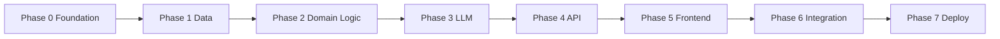
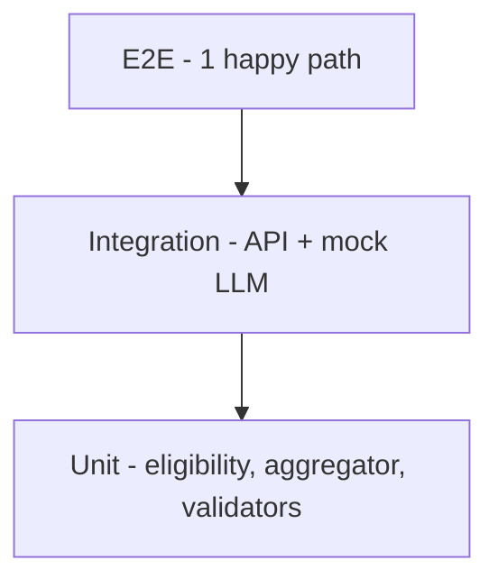
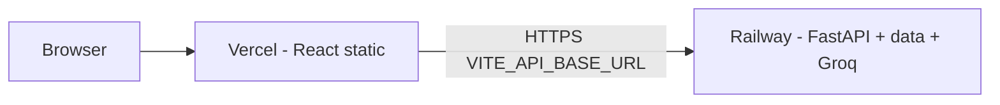
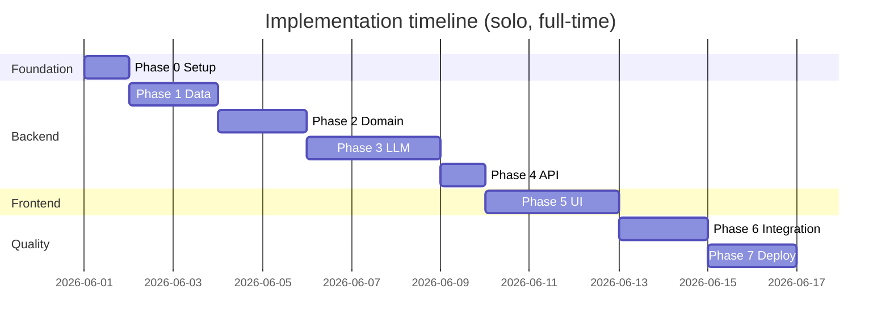

# Phase-Wise Implementation Plan

Implementation roadmap for the **AI-Powered Credit Card Recommendation Engine** (FreechargeBiz use case). This plan is derived from [`context.md`](./context.md) and [`architecture.md`](./architecture.md).

---

## Executive Summary

| Phase | Name | Primary outcome | Depends on |
|-------|------|-----------------|------------|
| **0** | Foundation & setup | Runnable repo, tooling, env template | — |
| **1** | Data & domain models | `cards.json`, synthetic AA, ingestion + Pydantic models | Phase 0 |
| **2** | Deterministic domain logic | Eligibility, spend aggregation, input validation | Phase 1 |
| **3** | LLM & orchestration | Prompt builder, LLM client, normalizer, orchestrator | Phase 2 |
| **4** | REST API + Groq | `POST /recommendations`, health, Groq LLM client | Phase 3 |
| **5** | Frontend UI | Profile form, AA connect, results display | Phase 4 |
| **6** | Integration & testing | E2E flow, mocked LLM in CI, manual LLM validation | Phase 5 |
| **7** | Hardening & deployment | Logging, Vercel + Railway deploy, README | Phase 6 |

**Recommended stack (per architecture):** Python 3.11+ · FastAPI · Pydantic · React + Vite · **Groq** Python SDK (`groq`) for LLM inference.

**Estimated calendar time (solo developer):** ~3–4 weeks at moderate pace; ~1.5–2 weeks if full-time and focused.

---

## Phase Dependency Overview



Each phase ends with **verifiable deliverables** before the next phase starts. Phases 4 and 5 can partially overlap only after Phase 3 exposes a stable API contract (mock responses acceptable for frontend start).

---

## Traceability Matrix

| `context.md` workflow | Architecture component | Implementation phase |
|----------------------|--------------------------|----------------------|
| 1. Data Ingestion | Data Ingestion Service, repositories | Phase 1 |
| 2. User Input | Validation module, UI forms | Phase 2 (backend), Phase 5 (UI) |
| 3. Integration Layer | Eligibility, Spend Aggregator, Prompt Builder, Orchestrator | Phase 2–3 |
| 4. Recommendation Engine (LLM) | LLM client, normalizer | Phase 3 |
| 5. Output Display | Results UI components | Phase 5 |

---

## Phase 0: Foundation & Project Setup

**Goal:** Establish repository structure, development workflow, and configuration patterns so later phases plug in cleanly.

### Tasks

| # | Task | Details |
|---|------|---------|
| 0.1 | Initialize repository layout | Create `backend/`, `frontend/`, `data/processed/`, `data/synthetic/` per [architecture § Repository Layout](./architecture.md#suggested-repository-layout) |
| 0.2 | Backend scaffold | FastAPI app entry (`backend/app/main.py`), `requirements.txt` (fastapi, uvicorn, pydantic, httpx, python-dotenv) |
| 0.3 | Frontend scaffold | Vite + React + TypeScript; ESLint/Prettier optional |
| 0.4 | Environment template | `.env.example` with `GROQ_API_KEY`, `GROQ_MODEL`, `LLM_MOCK`, `CARDS_DATA_PATH`, `AA_DATA_PATH`, `TOP_N_RECOMMENDATIONS` |
| 0.5 | Git ignore | `.env`, `__pycache__`, `node_modules`, `.venv` |
| 0.6 | Root README | How to run backend/frontend locally; link to `docs/` |
| 0.7 | Health stub | `GET /api/v1/health` returning `{ "status": "ok" }` |

### Deliverables

- [ ] Monorepo folders exist and both apps start locally
- [ ] `GET /api/v1/health` responds on port 8000
- [ ] Frontend dev server runs on port 5173 with API proxy to backend

### Acceptance criteria

- Developer can clone, install deps, and see health check without `GROQ_API_KEY` configured (mock LLM)

### Effort estimate

**0.5–1 day**

---

## Phase 1: Data Foundation & Ingestion

**Goal:** Satisfy **context workflow step 1** — load structured Axis Bank cards and synthetic AA data with validated domain models.

**Maps to:** Data Ingestion Service, Card Repository, AA Repository (`architecture.md` § Component Design §1).

### Tasks

| # | Task | Details |
|---|------|---------|
| 1.1 | Author `data/processed/cards.json` | 6–10 Axis Bank cards with: `id`, `name`, `image_url`, `annual_fee_inr`, `apr_percent`, `min_income_inr`, `min_cibil`, `reward_categories`, `default_earn_rate_percent`, `highlights` |
| 1.2 | Author `data/synthetic/aa_transactions.json` | `user_ref`, `transactions[]` with `date`, `amount_inr`, `category`, `merchant`, `type`; cover dining, travel, fuel, shopping, utilities |
| 1.3 | Define Pydantic models | `CardProduct`, `RewardCategory`, `Transaction`, `SpendProfile` in `backend/app/models/` |
| 1.4 | Implement ingestion service | `backend/app/domain/ingestion.py`: load JSON, validate required fields, in-memory cache |
| 1.5 | Card image placeholders | `frontend/public/assets/cards/` or paths referenced in JSON |
| 1.6 | Unit tests | Test load success, missing file → error, invalid card row handling |

### Sample card count by tier (suggested)

| Tier | Example products | Purpose |
|------|------------------|---------|
| Entry | Magnus Lite, Neo | Low income eligibility |
| Mid | Flipkart, My Zone | Broad category rewards |
| Premium | Magnus, Reserve | High income / CIBIL |

### Deliverables

- [ ] `cards.json` and `aa_transactions.json` committed and documented
- [ ] `load_cards()` and `load_aa_transactions()` return typed lists
- [ ] pytest covers happy path and missing-file case

### Acceptance criteria

- Ingestion loads all cards without error; logs count on startup
- At least 12 months of synthetic transactions (or enough to annualize categories)

### Effort estimate

**1–2 days**

---

## Phase 2: Deterministic Domain Logic

**Goal:** Implement rule-based preprocessing **before** any LLM call — eligibility filtering, spend aggregation, and request validation.

**Maps to:** Eligibility Engine, Spend Aggregator, Validation Module (`architecture.md` §§ 2–4).

### Tasks

| # | Task | Details |
|---|------|---------|
| 2.1 | `UserProfile` model | `annual_income_inr`, `pan`, `mobile`, `cibil` (optional, default e.g. 750 for demo), `aa_connected` |
| 2.2 | Input validators | PAN `AAAAA9999A`, 10-digit mobile, positive income bounds |
| 2.3 | Eligibility engine | `backend/app/domain/eligibility.py`: filter by `min_income_inr`, `min_cibil`; return `EligibleCard` with `passed_rules` |
| 2.4 | Spend aggregator | `backend/app/domain/spend_aggregator.py`: sum by category, annualize (×12 if monthly data), compute `total_annual` |
| 2.5 | Category normalization | Map merchant categories to card reward categories (e.g. `food` → `dining`) |
| 2.6 | Unit tests | Eligibility edge cases (income exactly at threshold); aggregation totals match hand calculation |

### Deliverables

- [ ] `filter_eligible_cards(catalog, profile) -> list[EligibleCard]`
- [ ] `build_spend_profile(transactions) -> SpendProfile`
- [ ] Validator functions used by API layer in Phase 4
- [ ] ≥90% unit test coverage on eligibility + aggregator modules

### Acceptance criteria

- Given demo profile (income 12L, CIBIL 780), eligible count is non-zero and deterministic
- Spend profile categories match expected totals from fixture JSON

### Effort estimate

**1–2 days**

---

## Phase 3: LLM Integration & Orchestration

**Goal:** Satisfy **context workflow steps 3–4** — merge eligible cards + spend + profile, call LLM, normalize structured recommendations.

**Maps to:** Prompt Builder, LLM Client, Response Normalizer, Recommendation Orchestrator (`architecture.md` §§ 5–7).

### Tasks

| # | Task | Details |
|---|------|---------|
| 3.1 | `RecommendationResponse` models | `CardRecommendation`, `RecommendationResponse`, `meta` block |
| 3.2 | Prompt builder | `backend/app/domain/prompt_builder.py`: system + user JSON per [architecture § LLM Integration](./architecture.md#llm-integration-design) |
| 3.3 | LLM client | `backend/app/services/llm_client.py`: **Groq** SDK (`GroqLLMClient`), `json_object` mode, timeout 60s, `GROQ_API_KEY` / `GROQ_MODEL`; keep `MockLLMClient` for CI |
| 3.4 | Response normalizer | `backend/app/domain/normalizer.py`: parse JSON, clamp confidence, sort by rank, enrich `image_url` from catalog, top N |
| 3.5 | Orchestrator | `backend/app/services/orchestrator.py`: sequence ingest → eligibility → spend (if `aa_connected`) → prompt → LLM → normalize |
| 3.6 | AA-required policy | If `aa_connected` is false → raise/return 422 (per architecture recommendation) |
| 3.7 | LLM retry | One retry on malformed JSON with “fix JSON only” follow-up prompt |
| 3.8 | Mock LLM for tests | Fixture returning valid `RecommendationResponse` JSON |
| 3.9 | CLI/script smoke test | `python -m scripts.run_recommendation` with sample profile (optional) |

### Prompt checklist

- [ ] System prompt restricts to provided `eligible_cards` only
- [ ] User message includes `user_profile`, `spend_profile`, trimmed card summaries
- [ ] Response schema documented in prompt (rank, card_id, confidence, net_annual_benefit_inr, explanation)

### Deliverables

- [ ] End-to-end orchestration callable from Python without HTTP
- [ ] Live Groq call returns ≥1 recommendation for demo fixture (wired in Phase 4; Phase 3 may use mock or OpenAI-compatible stub)
- [ ] Integration test uses **mocked** LLM; no API key in CI

### Acceptance criteria

- Orchestrator returns 3 top cards (or `TOP_N_RECOMMENDATIONS`) with all required fields
- Invalid LLM JSON triggers one retry; second failure surfaces 502-style error

### Effort estimate

**2–3 days** (prompt tuning may add time)

---

## Phase 4: REST API Layer

**Goal:** Expose orchestration via HTTP with the contract defined in `architecture.md` § API Contract. Live recommendations use **Groq** (not OpenAI).

**Maps to:** Application Layer — API, Validation, Orchestrator wiring, Groq LLM client.

### Tasks

| # | Task | Details |
|---|------|---------|
| 4.1 | Request/response schemas | Pydantic models mirroring `POST /api/v1/recommendations` body and 200 response |
| 4.2 | Route: recommendations | `backend/app/api/routes/recommendations.py` → orchestrator |
| 4.3 | Route: AA connect (optional) | `POST /api/v1/aa/connect` → `{ connected: true, spend_profile_id }` |
| 4.4 | Error mapping | 400 validation, 422 AA not connected, 404 no eligible cards, 502 Groq/LLM, 503 data load failure |
| 4.5 | CORS | Allow frontend origin in development |
| 4.6 | Request ID middleware | Log `request_id`, `eligible_count`, `groq_latency_ms` (no full PAN in logs) |
| 4.7 | API integration tests | TestClient: valid request → 200 with mocked LLM; invalid PAN → 400 |
| 4.8 | Groq client wiring | Replace generic OpenAI client with `GroqLLMClient` using `groq` package; `requirements.txt` → `groq`; `.env.example` → `GROQ_API_KEY`, `GROQ_MODEL=llama-3.3-70b-versatile` |
| 4.9 | Factory & config | `get_llm_client()`: `LLM_MOCK=true` or missing `GROQ_API_KEY` → mock; else Groq; document at [console.groq.com](https://console.groq.com/) |

### Deliverables

- [ ] `POST /api/v1/recommendations` documented in OpenAPI (`/docs`)
- [ ] Error responses match status table in architecture
- [ ] Integration tests pass with mock LLM

### Acceptance criteria

- curl/Postman can obtain recommendations with `aa_connected: true` and valid body
- OpenAPI spec matches implementation
- With `GROQ_API_KEY` set and `LLM_MOCK=false`, recommendations are produced via Groq (e.g. `llama-3.3-70b-versatile`)
- Without `GROQ_API_KEY`, API still works using mock LLM (suitable for CI)

### Groq setup (developer)

```bash
# .env
GROQ_API_KEY=gsk_...
GROQ_MODEL=llama-3.3-70b-versatile
LLM_MOCK=false
```

```bash
pip install groq
```

### Effort estimate

**1–1.5 days** (includes Groq client swap and smoke test with live key)

---

## Phase 5: Frontend UI

**Goal:** Satisfy **context workflow step 5** — FreechargeBiz-style user journey and results display.

**Maps to:** Presentation Layer (`architecture.md` § Frontend Architecture).

### Tasks

| # | Task | Details |
|---|------|---------|
| 5.1 | API client | `frontend/src/api/client.ts`: `connectAa()`, `getRecommendations(body)` |
| 5.2 | Profile form page | Fields: annual income, PAN, mobile; client-side format validation |
| 5.3 | Simulated AA connect | Button “Connect Account Aggregator”; sets `aa_connected`; optional call to `/aa/connect` |
| 5.4 | Submit flow | Disable submit until AA connected; loading state during LLM (skeleton/spinner) |
| 5.5 | Results page/components | Card tile: image, name, confidence (bar/badge), net annual benefit (₹ formatted), explanation |
| 5.6 | Error UX | Toasts or inline messages for 400/422/502/503 |
| 5.7 | Disclaimer | Footer: simulated data / not financial advice |
| 5.8 | Basic styling | Clean, mobile-friendly layout (Tailwind or CSS modules) |

### UI field mapping

| UI element | API field |
|------------|-----------|
| Card name & image | `card_name`, `image_url` |
| Confidence | `confidence_score` |
| Net benefit | `net_annual_benefit_inr` |
| Explanation | `explanation` |

### Deliverables

- [ ] User can complete flow entirely in browser against local API
- [ ] Results show top N cards with all four required display fields

### Acceptance criteria

- Matches success criteria from `context.md`: ranking, confidence, net benefit, rationale visible
- Loading state shown for multi-second LLM latency

### Effort estimate

**2–3 days**

---

## Phase 6: End-to-End Integration & Testing

**Goal:** Prove the full pipeline and lock quality before deployment.

**Maps to:** `architecture.md` § Testing Strategy.

### Tasks

| # | Task | Details |
|---|------|---------|
| 6.1 | Vite proxy | `/api` → `http://localhost:8000` |
| 6.2 | E2E test (Playwright/Cypress) | Fill form → connect AA → submit → assert ≥1 result card visible |
| 6.3 | Contract test | LLM mock fixture validates against `RecommendationResponse` schema |
| 6.4 | Manual test script | Document 3 personas (high dining, high travel, balanced) with expected top-card differences |
| 6.5 | Manual LLM run | One live call per persona; spot-check net benefit plausibility vs hand calc |
| 6.6 | No eligible cards path | Income below all thresholds → 404 with clear message |
| 6.7 | CI pipeline (optional) | GitHub Actions: backend pytest + frontend build + E2E with mock LLM |

### Test pyramid



### Deliverables

- [ ] E2E passes locally
- [ ] Manual test log completed for 3 personas
- [ ] CI green (if configured)

### Acceptance criteria (from `context.md` success criteria)

1. End-to-end: user input → LLM → displayed recommendations  
2. Grounded in `cards.json` and AA spend patterns  
3. Outputs include rank, confidence, net benefit, explanation  
4. UX suitable for FreechargeBiz-style discovery  

### Effort estimate

**1–2 days**

---

## Phase 7: Hardening, Observability & Deployment

**Goal:** Make the demo deployable, observable, and presentable for review or submission.

**Deployment target:** **Frontend → Vercel** · **Backend → Railway** (split services; API keys stay on Railway only).

**Maps to:** Cross-Cutting Concerns, Deployment View (`architecture.md`).

### Architecture (production)



### Tasks

| # | Task | Details |
|---|------|---------|
| 7.1 | Structured logging | `LOG_FORMAT=json` or text; `request_id`, `duration_ms` on every request; PAN masked in recommendation logs |
| 7.2 | Config validation | `validate_startup_config()` fails fast if `cards.json` / AA JSON missing |
| 7.3 | Railway backend | Root `Dockerfile` copies `backend/` + `data/`; `railway.toml` health check on `/api/v1/health`; `PORT` from Railway |
| 7.4 | Vercel frontend | `frontend/vercel.json` SPA rewrites; `VITE_API_BASE_URL` → Railway `/api/v1` |
| 7.5 | CORS for production | `CORS_ORIGINS` + optional `CORS_ORIGIN_REGEX` for `*.vercel.app` previews |
| 7.6 | Production README | [deployment.md](./deployment.md): env vars, demo PAN/income, health check |
| 7.7 | Demo video or screenshots | Optional for submission |
| 7.8 | Final doc sync | README links to `context.md`, `architecture.md`, `deployment.md`, this plan |

### Railway variables (backend)

| Variable | Purpose |
|----------|---------|
| `GROQ_API_KEY` | Live LLM (never commit) |
| `LLM_MOCK` | `true` for demo without Groq |
| `CORS_ORIGINS` | Vercel production URL |
| `CORS_ORIGIN_REGEX` | e.g. `https://.*\.vercel\.app` |
| `LOG_FORMAT` | `json` recommended on Railway |

### Vercel variables (frontend)

| Variable | Purpose |
|----------|---------|
| `VITE_API_BASE_URL` | `https://<railway-service>.up.railway.app/api/v1` |

### Deliverables

- [ ] Railway URL: `GET /api/v1/health` returns ok
- [ ] Vercel URL: full profile → AA → recommendations flow
- [ ] [deployment.md](./deployment.md) and README deployment section complete
- [ ] Disclaimer visible on results

### Acceptance criteria

- Third party can deploy from README / deployment doc without author assistance
- No secrets committed to repository
- Frontend never embeds `GROQ_API_KEY`

### Effort estimate

**1–2 days**

---

## Consolidated Task Checklist (All Phases)

Use this as a single sprint board:

```
Phase 0  [ ] Repo layout  [ ] FastAPI  [ ] Vite React  [ ] .env.example  [ ] Health
Phase 1  [ ] cards.json  [ ] aa_transactions.json  [ ] Models  [ ] Ingestion  [ ] Tests
Phase 2  [ ] Validators  [ ] Eligibility  [ ] Spend aggregator  [ ] Tests
Phase 3  [ ] Prompt builder  [ ] LLM client  [ ] Normalizer  [ ] Orchestrator  [ ] Mock LLM tests
Phase 4  [ ] POST /recommendations  [ ] Errors  [ ] CORS  [ ] API tests
Phase 5  [ ] Form  [ ] AA button  [ ] Results UI  [ ] Errors  [ ] Disclaimer
Phase 6  [ ] E2E  [ ] Manual personas  [ ] CI (optional)
Phase 7  [ ] Logging  [ ] Railway backend  [ ] Vercel frontend  [ ] deployment.md
```

---

## Suggested Timeline (Gantt-style)



Adjust dates to your schedule; Phases 1–4 are backend-critical path; Phase 5 starts only after API contract is stable.

---

## Risk Register & Mitigations

| Risk | Impact | Mitigation |
|------|--------|------------|
| LLM hallucinates cards not in catalog | Wrong recommendations | Strict prompt; normalizer drops unknown `card_id`; eligibility list only in prompt |
| LLM returns invalid JSON | 502 errors | JSON mode; retry once; mock tests in CI |
| Net benefit numbers unreliable | Misleading UI | Label as “simulated”; optional Phase 3b: deterministic reward calculator |
| High LLM latency | Poor UX | Loading skeleton; send trimmed card summaries only |
| Sparse `cards.json` | Weak demo | Minimum 6–8 diverse Axis products in Phase 1 |
| API key exposed | Security incident | `GROQ_API_KEY` server-side only; scan repo before push |

---

## Optional Enhancements (Post-MVP)

Not required for `context.md` success criteria; align with `architecture.md` § Future Extensions:

| Enhancement | Phase to insert |
|-------------|-----------------|
| Deterministic reward calculator (hybrid LLM) | After Phase 3 |
| Multiple AA personas selectable in UI | Phase 5 |
| CIBIL input on form | Phase 2 + 5 |
| `POST /aa/connect` with persona picker | Phase 4–5 |
| SQLite card store instead of JSON | Phase 1 |

---

## Definition of Done (Project Complete)

The project is **done** when all of the following are true:

- [ ] User enters income, PAN, mobile and connects simulated AA  
- [ ] System loads `data/processed/cards.json` and synthetic AA data  
- [ ] Eligibility filters cards by income/CIBIL before LLM  
- [ ] LLM ranks cards, explains fit using spend categories, and returns net annual benefit  
- [ ] UI shows card name, image, confidence, net benefit, and AI explanation  
- [ ] Automated tests cover domain logic and API (LLM mocked in CI)  
- [ ] README enables local run and documents architecture references  
- [ ] Out-of-scope items remain unimplemented (no live AA, no non-Axis catalog)

---

## Document References

| Document | Purpose |
|----------|---------|
| [`docs/context.md`](./context.md) | Scope, workflow, success criteria |
| [`docs/architecture.md`](./architecture.md) | Components, APIs, data schemas, testing |
| [`docs/problemStatement.txt`](./problemStatement.txt) | Original requirements |

---

*Generated from project context and architecture documents. Update phase dates and checkboxes as work progresses.*
